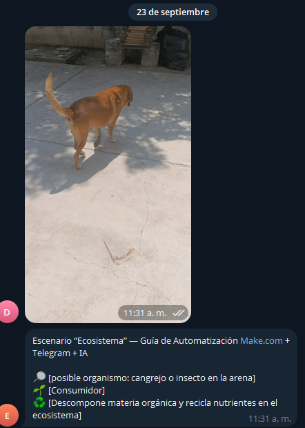
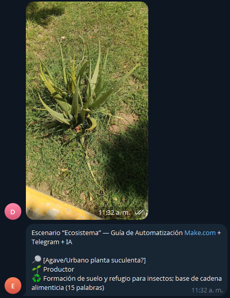
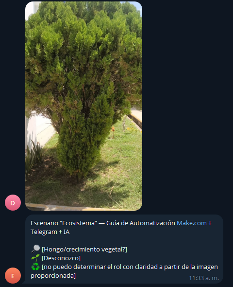

# Ecosistema
## Descripción

En este proyecto nos encargamos en realizar una automatización en la cual cada que mandes una foto la IA de Make te envié un mensaje en el cual nos diga que tipo de planta es, nombre, rol en el ecosistema. Se realizo la automatización en Make, también en telegram se realizo un bot para que mande la imagen y ahi te contesta.

## Objetivos de aprendizaje

Realizar una automatización que nos permita conocer el papel que ocupa cada ser vivo en el planeta y su ecosistema, desde las hormigas, flores, perros y los mismos seres humanos.

## Material utilizado

-Celular
-Make

## Diagrama

## Código

[Blueprint](Codigo/Ecosistema.blueprint.json)

## Video del funcionamiento

[Ver video en YouTube](enlace-al-video)

## Evidencia

###

## Reporte

[Resultados.pdf](Resultados/Resultados.pdf)

## Conclusiones

La práctica nos permitió conocer las funciones de los organismos vivos en el ecosistema y a su vez nos permitió aprender a realizar una automatización que permita solo contestar a imágenes o solo texto.

## Resultados

[Resultados.pdf](Resultados/Resultados.pdf)
